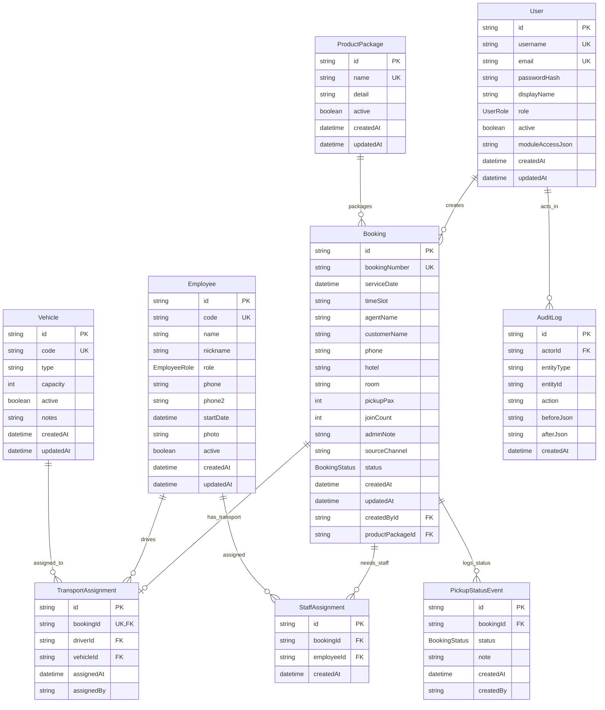

# Database ERD

Source of truth: `packages/db/prisma/schema.prisma` and current migrations under `packages/db/prisma/migrations`.

## Notes

- Database provider is PostgreSQL via Prisma.
- `PickupStatusEvent.createdBy` is currently a plain string column, not a foreign key to `User`.
- `TransportAssignment.assignedBy` is currently a plain string column, not a foreign key to `User`.
- `TransportAssignment.bookingId` is unique, so one booking can have at most one transport assignment.
- `StaffAssignment` is a join table for many-to-many between `Booking` and `Employee`.
